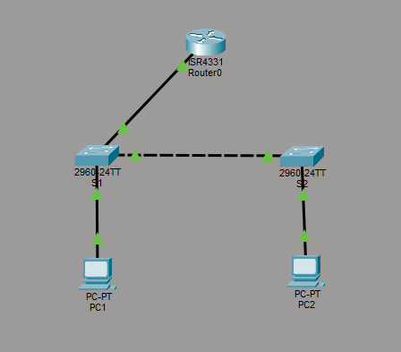

# Cisco Router-on-a-Stick Lab

A hands-on Cisco networking lab demonstrating VLAN segmentation, 802.1Q trunking, and inter-VLAN routing using the Router-on-a-Stick architecture.

## Overview

This project demonstrates how multiple VLANs can communicate through a single physical router interface using 802.1Q trunking and router subinterfaces.

The lab was built and tested using Cisco Packet Tracer.

## Network Topology



## Network Architecture

The topology consists of:

- 1 Cisco ISR4300 router
- 2 Cisco Catalyst 2960 switches
- 2 end devices
- 2 VLANs
- 802.1Q trunk links
- Router-on-a-Stick inter-VLAN routing

### Physical Connections

| Device | Interface | Connected To | Purpose |
|---|---|---|---|
| Router0 | Gi0/0/0 | S1 Fa0/1 | 802.1Q trunk |
| S1 | Fa0/2 | S2 Fa0/1 | 802.1Q trunk |
| S1 | Fa0/3 | PC1 | VLAN 10 access |
| S2 | Fa0/2 | PC2 | VLAN 20 access |

## VLAN and IP Addressing

| VLAN | Name | Network | Default Gateway | Host |
|---:|---|---|---|---|
| 10 | VLAN10 | 192.168.10.0/24 | 192.168.10.1 | PC1 |
| 20 | VLAN20 | 192.168.20.0/24 | 192.168.20.1 | PC2 |

### End Devices

| Device | IP Address | Subnet Mask | Default Gateway |
|---|---|---|---|
| PC1 | 192.168.10.10 | 255.255.255.0 | 192.168.10.1 |
| PC2 | 192.168.20.10 | 255.255.255.0 | 192.168.20.1 |

## How Router-on-a-Stick Works

The router uses a single physical interface to provide Layer 3 connectivity for multiple VLANs.

The physical interface `Gi0/0/0` is connected to S1 using an 802.1Q trunk.

Two router subinterfaces are configured:

- `Gi0/0/0.10` → VLAN 10 → `192.168.10.1`
- `Gi0/0/0.20` → VLAN 20 → `192.168.20.1`

The router acts as the default gateway for both VLANs and performs the Layer 3 routing required for communication between them.

## Traffic Flow

When PC1 communicates with PC2:

```text
PC1
192.168.10.10
    |
    | VLAN 10
    v
S1 Fa0/3
    |
    | 802.1Q trunk
    v
Router0 Gi0/0/0.10
192.168.10.1
    |
    | Layer 3 routing
    v
Router0 Gi0/0/0.20
192.168.20.1
    |
    | 802.1Q trunk
    v
S1
    |
    | 802.1Q trunk
    v
S2
    |
    | VLAN 20
    v
PC2
192.168.20.10
